<p align="center">
  
</p>

<h1 align="center">Glassy System Monitor</h1>

<p align="center">
  <a href="https://www.opendesktop.org/p/2360341">
    
  </a>
  
  <a href="LICENSE">
    
  </a>
  <a href="https://www.opendesktop.org/p/2360341">
    
  </a>
  <a href="https://github.com/Muddyblack/kde-glassy-system-monitor/releases">
    
  </a>
</p>

<p align="center">
  
</p>

<p align="center">
  <a href="#features">Features</a> ·
  <a href="#requirements">Requirements</a> ·
  <a href="#install">Install</a> ·
  <a href="#configuration">Configuration</a> ·
  <a href="#how-it-works">How it works</a>
</p>

---

A glassy real-time system monitor for KDE Plasma 6. Tracks **ping · CPU · memory · network** in one place. The main thing that makes it different from built-in widgets is the ping section — you get live RTT graphs, jitter, and packet loss, not just bandwidth.

## Features

### Monitoring sections

- **Ping graph** — smooth Bézier chart scrolling in real time, RTT in milliseconds
- **Multi-target tabs** — monitor up to 4 hosts at once (e.g. `8.8.8.8`, `1.1.1.1`, your router), switch with one click
- **CPU** — overall usage with optional per-core overlays
- **Memory** — RAM + swap
- **Network** — upload/download bandwidth, session totals, per-interface selection, and an optional SSID / IP readout
- **GPU** — utilization, clock, and an optional **per-engine breakdown** (VRAM, compute, decode, encode) — best-effort across NVIDIA, AMD, and Intel
- **Disk I/O** — read/write throughput per device
- **Power** — battery state and draw
- **Hardware sensors** — temperatures with warning/critical thresholds
- **OS info** — distro and host details
- **Custom command** — chart the output of any shell command on an interval

### Network insight

- **Jitter** — standard deviation over the rolling history window
- **Packet loss** — lost pings shown as red dots on the graph; loss % in the stats bar
- **Alert indicators** — line turns amber above the latency threshold, red at 1.5×; a pulsing border when alerting

### Look & feel

- **Glassy look** — semi-transparent dark card with neon glow, same aesthetic as the [Plasma Audio Visualizer](https://github.com/muddyblack/plasma-audio-visualizer)
- **GPU bloom** — optional GPU-accelerated halo on graph lines, drawn under crisp axis/text so labels stay sharp
- **Frosted glass** — optional blurred backdrop with adjustable strength
- **Multiple chart styles** — line, bars, donut, pie, horizontal bar
- **Theming** — honors the active Plasma accent color (or set custom colors per section), system text color, configurable background color and corner radius
- **Compact panel mode** — condensed representation for panel placement

---

## Requirements

| Dependency | Notes |
|---|---|
| KDE Plasma 6.0+ | `X-Plasma-API-Minimum-Version: 6.0` |
| `plasma5support` | Provides the `executable` DataEngine used for ping and stats |
| `ping` (iputils) | Standard on all Linux distros |

Optional, for richer data when present (the widget degrades gracefully without them):

| Tool | Enables |
|---|---|
| `nvidia-smi` | NVIDIA GPU utilization, encode/decode, VRAM |
| `sensors` (lm-sensors) | Hardware temperature sensors |
| `iwgetid` / `iw` / `nmcli` | Network SSID readout |

---

## Install

<details open>
  <summary><b>Manual (any distro)</b></summary>

```bash
git clone https://github.com/Muddyblack/kde-glassy-system-monitor.git
cd kde-glassy-system-monitor
kpackagetool6 -t Plasma/Applet -i package
# or to update an existing install:
kpackagetool6 -t Plasma/Applet -u package
```

Then right-click your desktop → *Add Widgets* → search **"Glassy System Monitor"**.

To remove:

```bash
kpackagetool6 -t Plasma/Applet -r org.muddyblack.glassySystemMonitor
```

</details>

<details>
  <summary><b>Development / test install</b></summary>

```bash
./test_install.sh
```

To remove the test copy:

```bash
kpackagetool6 -t Plasma/Applet -r org.muddyblack.glassySystemMonitorTest
```

</details>

<details>
  <summary><b>NixOS (flake)</b></summary>

```nix
# flake.nix
{
  inputs.glassy-monitor.url = "github:Muddyblack/kde-glassy-system-monitor";

  outputs = { self, nixpkgs, glassy-monitor, ... }: {
    nixosConfigurations.mybox = nixpkgs.lib.nixosSystem {
      modules = [
        ({ pkgs, ... }: {
          environment.systemPackages = [
            glassy-monitor.packages.${pkgs.system}.default
          ];
        })
      ];
    };
  };
}
```

</details>

<details>
  <summary><b>Package as <code>.plasmoid</code> (for the KDE Store)</b></summary>

```bash
./pack.sh
# produces glassy-system-monitor-<version>.plasmoid
```

</details>

---

## Configuration

Right-click the widget → *Configure*:

| Setting | Default | Description |
|---|---|---|
| **Hosts** | `8.8.8.8,1.1.1.1,192.168.1.1` | Comma-separated ping targets (max 4) |
| **Ping interval** | `2 s` | Time between pings |
| **Timeout** | `2 s` | Per-ping timeout, counts as packet loss |
| **History points** | `60` | Rolling sample count per target |
| **Latency warning** | `100 ms` | Line turns amber above this |
| **Loss warning** | `5 %` | Alert border activates above this loss rate |
| **GPU engines** | on | Per-engine breakdown (VRAM, compute, decode, encode) — shows only what your GPU exposes |
| **Network info** | off | Show current SSID / IP address |
| **Line color** | system accent | Or pick a custom color |
| **Glow** | on | Neon shadow on graph lines |
| **GPU bloom** | off | GPU-accelerated halo on graph lines |
| **Stats bar** | on | Jitter, loss, min/max below the graph |
| **Background card** | on | Semi-transparent glass card behind the widget |

---

## How it works

The widget has no compiled backend — every section reads from the system through the
`executable` DataEngine on its own timer, parses the output in QML, and pushes it into
a rolling history buffer that the charts draw.

- **Ping** runs `ping` per target and parses RTT / loss.
- **CPU / memory** read `/proc/stat` and `/proc/meminfo`.
- **Network** reads `/proc/net/dev`; SSID / IP come from `iwgetid` / `iw` / `nmcli` and `ip`.
- **GPU** uses `nvidia-smi` on NVIDIA, sysfs on AMD, and DRM `fdinfo` on Intel/others —
  the per-engine breakdown sums each engine's counters across processes and diffs them
  between polls to derive utilization. Each metric appears only when the backend reports it.
- **Sensors** parse `sensors -j`.

Charts use a split-layer renderer: the glowing data lines are drawn to a separate canvas
and blurred on the GPU, then composited *under* the crisp axis, grid, and labels so text
never blurs.
